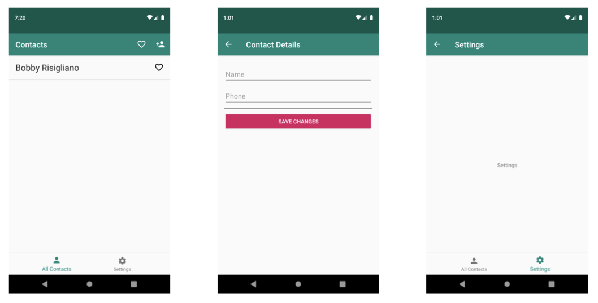

# contacts

Demo Application created for Navigation Architecture Component workshops.

## Lab

There is a companion lab at : [https://cutt.ly/as-2019-nav-lab](https://cutt.ly/as-2019-nav-lab).  The lab is separated into 3 parts.  

If you have issues accessing the link above, you can download the file from the repository as a PDF at this [link](https://github.com/ericmaxwell2003/contacts/raw/starter/lab_1/Navigation%20Lab%20Manual.pdf).

## Branches

* [starter/lab_1](https://github.com/ericmaxwell2003/contacts) - The default branch, this has the lab starter code.
* [starter/lab_2](https://github.com/ericmaxwell2003/contacts/tree/starter/lab_2) - This branch starts after the completion of lab 1, so you can start lab 2.
* [starter/lab_3](https://github.com/ericmaxwell2003/contacts/tree/starter/lab_3) - This branch starts after the completion of lab 2, so you can start lab 3.

